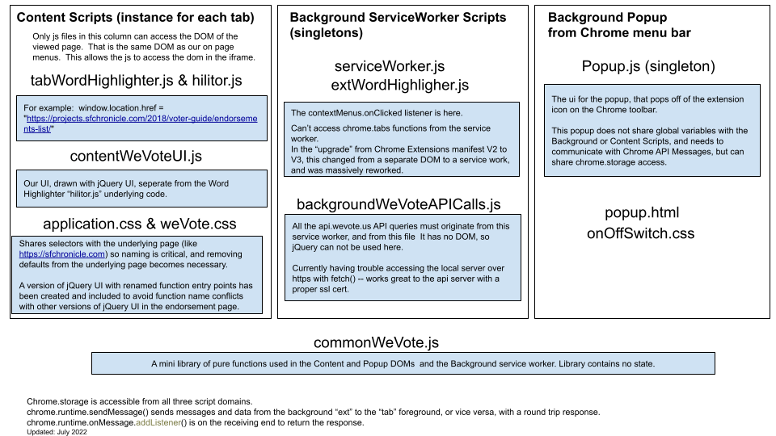
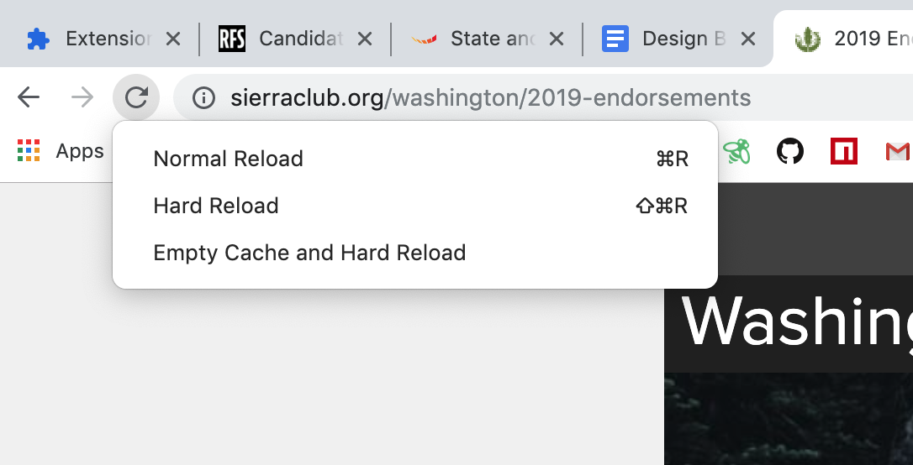
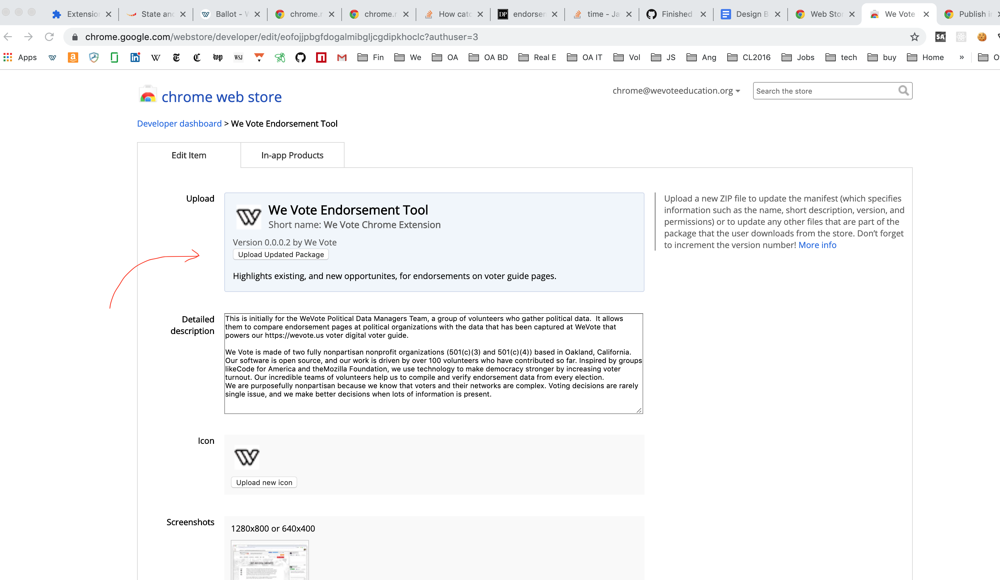
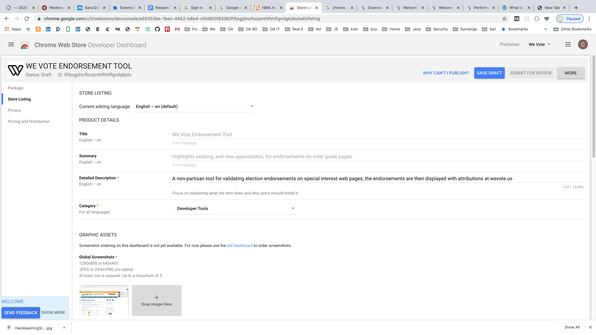
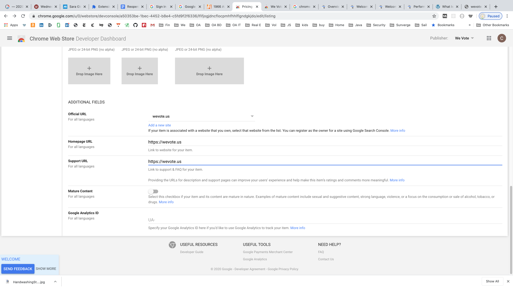
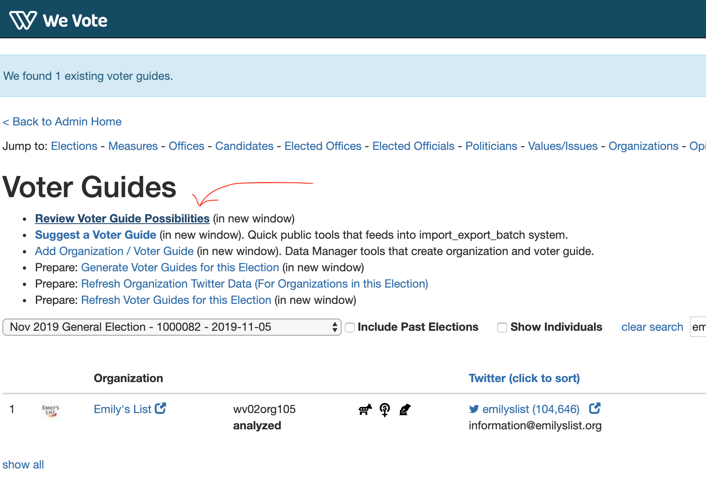
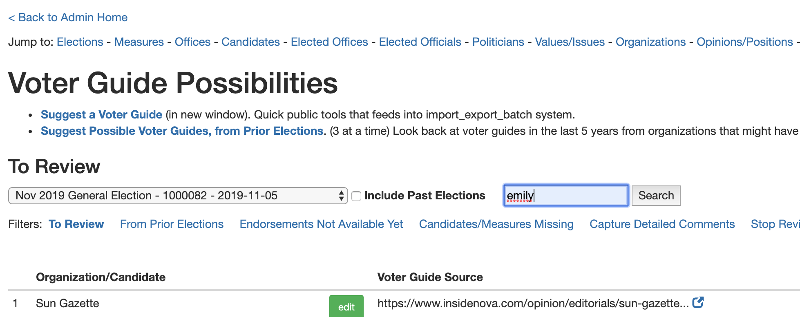
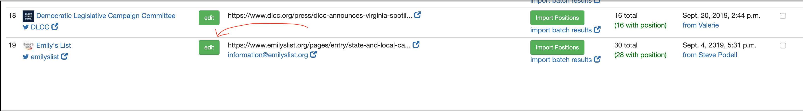
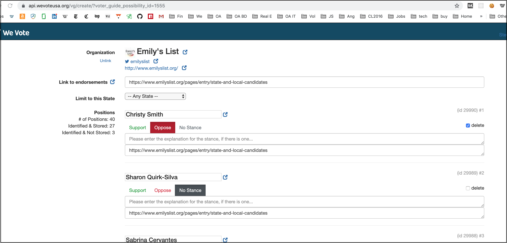
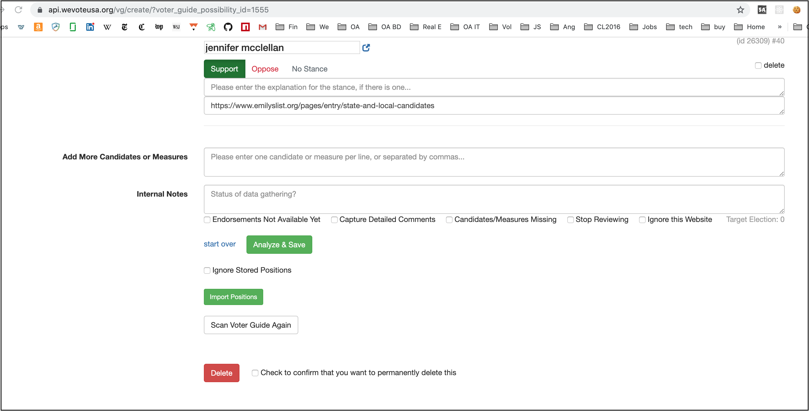

# We Vote Chrome Extension for Endorsement Maintenance and Discovery

This code base was forked from [Highlight This: finds and marks words](https://chrome.google.com/webstore/detail/highlight-this-finds-and/fgmbnmjmbjenlhbefngfibmjkpbcljaj?hl=en)
with many thanks to, and the permision of, [Wim Deboel](http://deboel.eu/).

## For developers

1. Simply fork this repository
2. Open [chrome://extensions/](chrome://extensions/) 
3. Turn on Developer mode in the upper right corner
4. Click the "Load unpacked", and select the root directory of the repository ... something like /Users/stevepodell/WebstormProjects/WeVoteExtension
5. And the We Vote icon should appear in the top toolbar of chrome
  
6. Clicking the "background page" link opens a chrome devtools instance that can be used to 
debug your "Content Script" (Content scripts are the only component of an extension that has access to the web-page's DOM).

Files:

Notes: 
That "Errors" button on the [chrome://extensions/](chrome://extensions/) shows some code validation errors, and some
runtime errors.  It can be useful, but not as useful as the "background page" devtools.

<!-- https://docs.google.com/drawings/d/1C32qtyMrsqAZXxN7TEG3lryZXn56owVHnZhwxoAAOLo/edit?usp=sharing -->

### Debugging notes
* The (otherwise excellent) Chrome Dev Tools debugger, gets confused with extensions.  
* Usually you will have to press the refresh (circular arrow icon) on the extension tab, to load the
latest version of the extension code.

* Then you will need to update the tab where you are debugging the extension, the Hard Reload might be all you
need with 'Shift+Option+R', but it always does the job with the "Empty Cache and Hard Reload"
(which will only be present if you are using the debugger on that tab.) 

Resources leak:
* The (still otherwise excellent) Chrome Dev Tools debugger, appears to leak resources when you do a hard refresh
while it is at a breakpoint.  The symptoms are the tab becomes slower to load, and eventually becomes non
responsive.  When this happens close the tab, and reload it using Chrome's History/Recently Closed
menu item.

## Publishing an Update

[See the Chrome doc](https://developer.chrome.com/webstore/publish)

[Create a new zip file](https://developer.chrome.com/apps/hosting)

In MacOS, in finder, just select your working directory (something like `/Users/stevepodell/WebstormProjects/EndorsementExtension
`) right click on it, and choose `Compress "Endorsement Extension"` which creates an `EndorsementExtension.zip` file.

Get the login credentials for chrome@wevoteeducation.org from Dale.

Login to the chrome developer console [https://chrome.google.com/webstore/developer/edit/eofojjpbgfdogalmibgljcgdipkhoclc?authuser=3](https://chrome.google.com/webstore/developer/edit/eofojjpbgfdogalmibgljcgdipkhoclc?authuser=3)

May 2020: The boiler plate needed for the "new chrome store website", you will have to type this in for each release.

And at the very bottom of the page, press the `Publish changes` button.  And press `Ok` on the confirm dialog.  The you
will see a dialog that says something like "Your item is in the process of being published and may take up to 60 minutes to appear in the Chrome Web Store." -- Then you are done.

### Note May 2020

**Do not release a new version from the new console, it makes a compeletely new chrome store entry with a new id, 
which will not match **
            if (sender.id === 'pmpmiggdjnjhdlhgpfcafbkghhcjocai' ||
                sender.id === 'lfifjogjdncflocpmhfhhlflgndgkjdo' ||
                sender.id === 'eofojjpbgfdogalmibgljcgdipkhoclc' ||
                sender.id === 'highlightthis@deboel.eu') {

**And therefore will not work (the chrome store auto-releases new versions) also since it has a new ID, the installed base
will not receive the updates automatically.

On the [Chrome Store Dev Console](https://chrome.google.com/u/2/webstore/devconsole/a50353be-1bec-4452-b8e4-c5fd9f2f6336/eofojjpbgfdogalmibgljcgdipkhoclc/edit/package?hl=en)
go to the **Package** tab on the left side menu, to replace the current release.

## Testing: Deleting an possibility that was made from the left pane
Voter Guide endorsements can be in the "Possibilities" state (Recommended by a voter or a WeVote power volunteer), or "Stored"
one we are more sure about.  This chrome extension displays both kinds as highlights on the original page (in the left pane), 
and as a list in the right pane. "Possibilities" will have less data, and will not have WeVi=oteCandidateIds, so the link to
the webapp won't work for them.

In the left pane, right clicking, and then choosing "Create We Vote Endorsement", creates a new "Possibility", which
are in a different table on the server, and are accessed in a different way in the menus.

From the Voter Guide menu in the Admin Interface (Python Templates) on the API server, select "Review Voter Guide 
Possibilities"

You can use <table> tag to create tables without header.

   
Then search for the organization's endorsement page.  

   

The search is a bit dodgy (September 21, 2019) and you might get lots
of extraneous results, plus some older endorsement pages, so  you might have to find the one you are interested in by
trial and error.  To choose one, don't click on its name, click on the green "Edit" button. 

   

When you get to the page, in this example, we are selecting Christy Smith for deletion, by 
clicking the check box to the right.

Finally, scroll to the bottom, and DO NOT press 'Delete' that deletes the entire voter guide possiblity record,
 including all the voter guide possibility position records.  Instead press "Analyze & Save",
 to delete Christy's position possibility record.
  
 

