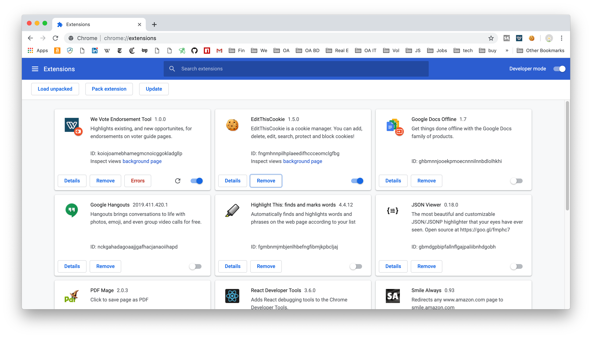
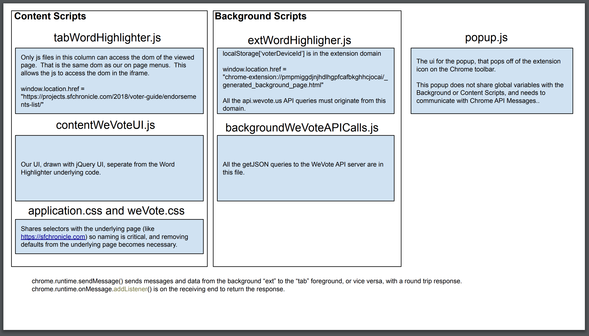

# We Vote Chrome Extension for Endorsement Maintenance and Discovery

This code base was forked from [Highlight This: finds and marks words](https://chrome.google.com/webstore/detail/highlight-this-finds-and/fgmbnmjmbjenlhbefngfibmjkpbcljaj?hl=en)
with many thanks to, and the permision of, [Wim Deboel](http://deboel.eu/).

# For developers

1. Simply fork this repository
2. Open [chrome://extensions/](chrome://extensions/) 
3. Turn on Developer mode in the upper right corner
4. Click the "Load unpacked", and select the root directory of the repository ... something like /Users/stevepodell/WebstormProjects/WeVoteExtension
5. And the We Vote icon should appear in the top toolbar of chrome
  
6. Clicking the "background page" link opens a chrome devtools instance that can be used to 
debug your "Content Script" (Content scripts are the only component of an extension that has access to the web-page's DOM).

Files:

Notes: 
That "Errors" button on the [chrome://extensions/](chrome://extensions/) shows some code validation errors, and some
runtime errors.  It can be useful, but not as useful as the "background page" devtools.

<!-- https://docs.google.com/drawings/d/1C32qtyMrsqAZXxN7TEG3lryZXn56owVHnZhwxoAAOLo/edit?usp=sharing -->

# Publishing an Update

[See the Chrome doc](https://developer.chrome.com/webstore/publish)

[Create a new zip file](https://developer.chrome.com/apps/hosting)

In MacOS, in finder, just select your working directory (something like `/Users/stevepodell/WebstormProjects/EndorsementExtension
`) right click on it, and choose `Compress "Endorsement Extension"` which creates an `EndorsementExtension.zip` file.

Get the login credentials for chrome@wevoteeducation.org from Dale.

Login to the chrome developer console [https://chrome.google.com/webstore/developer/edit/eofojjpbgfdogalmibgljcgdipkhoclc?authuser=3](https://chrome.google.com/webstore/developer/edit/eofojjpbgfdogalmibgljcgdipkhoclc?authuser=3)

And at the very bottom of the page, press the `Publish changes` button.  And press `Ok` on the confirm dialog.  The you
will see a dialog that says something like "Your item is in the process of being published and may take up to 60 minutes to appear in the Chrome Web Store." -- Then you are done.

   
